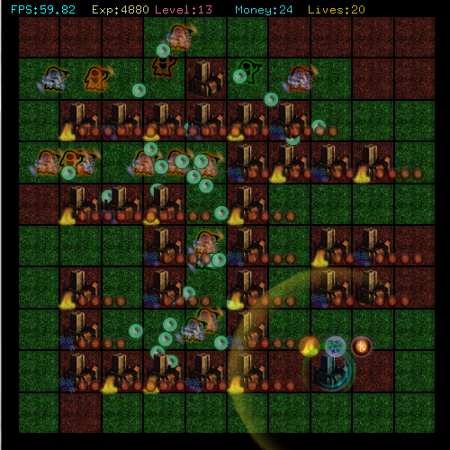

# Empire Defense

Version 0.11

Tower Defense Game with Multiplayer (up to 8)

**WIP**

* The online mode is disabled on purpose.
* The loading time at the beginning is only for the OGG... I need to multithread this part.
* The game is very unbalanced now... It is just an alpha version. There is also no ending
* My best lvl is 15 (after testing it for 10min)
* 3 maps, 1 with a long road
* You can add spells directly to the tower
* No player spell/skill restriction (You can choose any spell/tower you want)

Keys :

* Holding \<Shift> : Allow to construct many towers without selecting it between each construction (really useful)
* \<F1> : Show Help
* \<F2> : Show Grid
* \<F5> : Reload Shaders
* \<F6> : Reload Colors
* \<F7> : Change the player (to simulate Multiplayer mode)
* \<F10> : MAIN MENU
* \<F11> : FullScreen

- \<Page Up>   : Zoom +
- \<Page Down> : Zoom -

Shortcuts for towers are automatically based on the first letter of the tower :
- \<A> : Arrow Tower
- \<S> : Stone Tower (canon)
- \<L> : Laser Tower
- \<M> : Missile Tower

"Fire" : Damage over the time
"Ice"  : Slow the unit
"Light": Increase the visibility
"Earth": Stun the unit
"Poison": Reduce the armor

To evoluate a tower : click on a tower and choose the evolution
Canon Tower cannot use spells except if the spell is AOE (there is none atm)

There is no End to the game right now :p
But you can fill the files to increase the content (tell me if you do and balance the game): 
 - "spells.txt" : All the effects
 - "towers.txt" : All the towers
 - "ammo.txt" : Ammo linked to the towers. Many towers can have the same ammo.
 - "unit.txt" : All the unit used by the party (will be load depending of the map later)
 
 
 Enjoy the game !
 Send comments at empiredefense@crystalin.fr or on http://empire-defense.crystalin.fr

# Old versions

## v0.2

## v0.3

## v0.4c

## v0.5c

